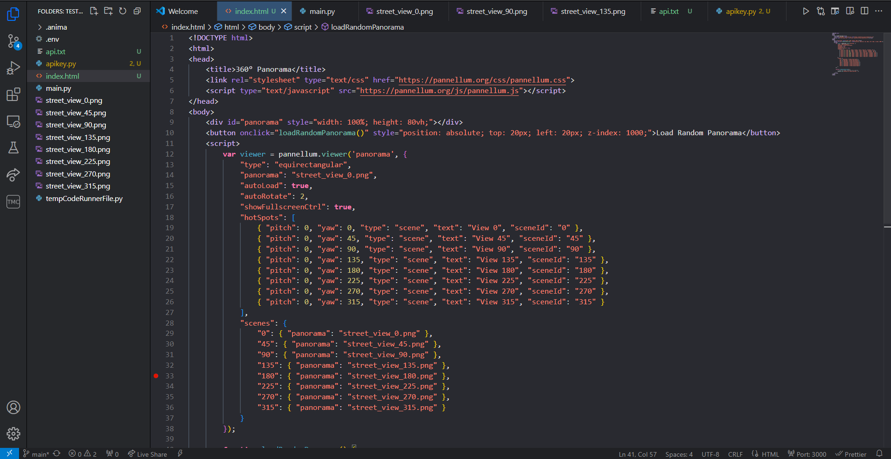

# 🏙️ Test Street View Application
This project is a Python-based tool to fetch and display Google Street View images from various angles, built using **HTML**, **Python**, and Google Maps APIs.

Link to Github Pages Deployment: https://keremsemiz.github.io/test-streetview/

## 🌟 Features

- 📷 **Multiple Street View Angles**: Capture and display street view images at various angles (0°, 45°, 90°, etc.).
- 🔑 **API Key Integration**: Uses the Google Street View API for image retrieval.
- 🌐 **Simple HTML Output**: Displays the captured street view images in a simple HTML page.

## 📂 Project Structure

The project is organized into the following files and directories:

- **`.anima/`**: Contains animation-related files for the project (if applicable).
- **`.env`**: Environment file to store sensitive data such as API keys.
- **`index.html`**: Displays the street view images captured by the script.
- **`main.py`**: The main Python script that interacts with the Google Street View API and generates images.
- **`street_view_*.png`**: Image files of street views captured at different angles (e.g., 0°, 45°, 90°, etc.).
- **`tempCodeRunnerFile.py`**: Temporary Python file generated by VS Code (you can ignore this file).

## 🛠️ Prerequisites

Before running this project, ensure you have the following installed:

- **Python 3.x**
- **Google Street View API key** (Make sure to add your API key to the appropriate file or environment variable.)